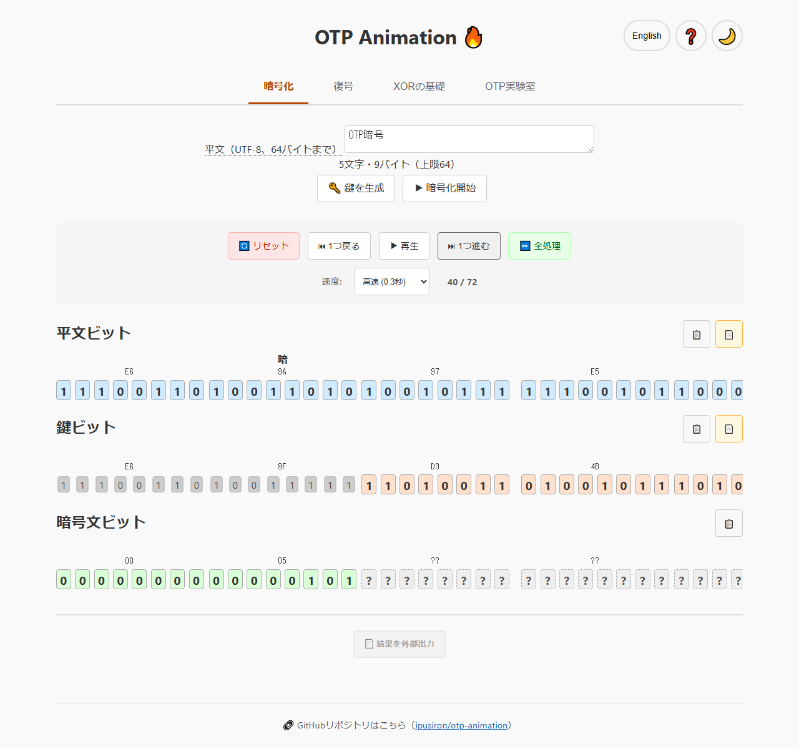
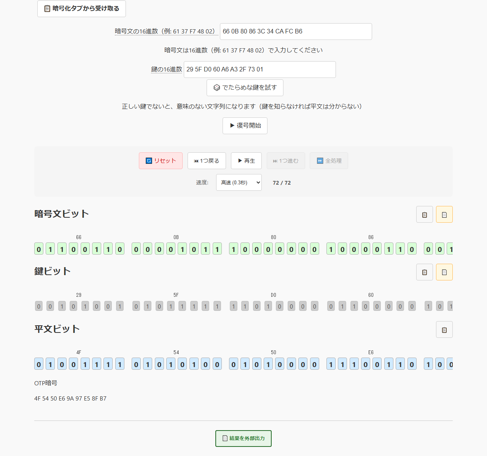
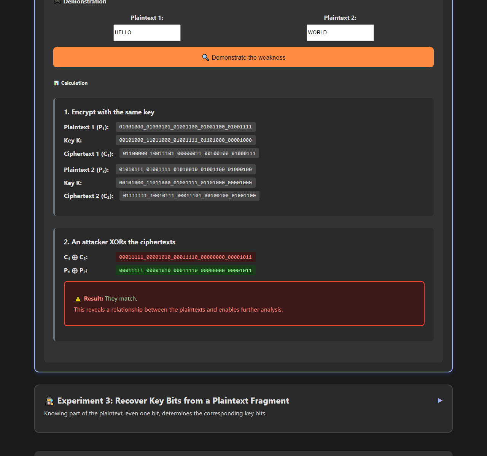

# OTP Animation - One-Time Pad Encryption Animation Tool

日本語: [README.md](README.md)


[](https://ipusiron.github.io/otp-animation/)

**Day029 - 100 Security Tools with Generative AI**

OTP Animation teaches the one-time pad through bit-by-bit XOR and a burning-key animation.
It supports UTF-8 text, including Japanese and emoji, with four tabs and three experiments in Japanese and English.

## 🌐 Demo

[Open OTP Animation in your browser](https://ipusiron.github.io/otp-animation/)

## 📸 Screenshots



Light Japanese UI: OTP暗号 after 40 bits, with the rows scrolled to the three bytes of 暗. 1280×1200, 55,572 bytes.



Light Japanese UI: received ciphertext and key, and the recovered plaintext, after scrolling down. 1280×1200, 54,333 bytes.



Dark English UI: Experiment 2 with HELLO and WORLD, showing C₁⊕C₂＝P₁⊕P₂. 1280×1200, 53,826 bytes.

## ✨ Features

- UTF-8 plaintext up to 64 bytes, grouped by character with hexadecimal and bit views
- Keys of the same byte length generated using crypto.getRandomValues
- Bit-by-bit XOR playback, pause, forward and backward steps, with consumed key bits shown as ash
- Decryption from hexadecimal ciphertext and key; invalid UTF-8 shown with replacement characters and a note
- Bit-string copy and paste, and text-file result exports
- Japanese/English switching that preserves state, plus persistent light and dark themes
- XOR basics and three experiments: gate construction, key reuse and known-plaintext fragments

The burning animation is a visual effect. It does not securely erase keys.

## 📖 Usage

### Encryption tab

1. Enter plaintext such as HELLO, OTP暗号 or 😀. Check the character count and UTF-8 byte count.
2. Select “🔑 Generate key” to create an equally long key. Unprocessed ciphertext bits appear as “?”.
3. Select “▶ Start encryption”. Use playback, pause, forward/backward steps, reset or completion controls.
4. Once complete, export the result to a text file.

Editing plaintext clears the key, progress and ciphertext, and stops playback. Encryption cannot start before generating a key.
Five speed settings range from 0.1 to 2 seconds per bit. Narrow displays scroll inside the bit rows, not across the page.

### Decryption tab

1. Receive both ciphertext and key from the Encryption tab, or enter each as hexadecimal.
2. Start decryption or complete all steps to display the original UTF-8 text.
3. Try a random key of the same length to compare it with the correct key.

Editing inputs clears the previous result and progress. Ciphertext and key must have equal lengths.
Invalid byte sequences are shown as U+FFFD with an explanatory note. A wrong key may coincidentally produce readable text.

### XOR Basics tab

Explore the truth table, commutativity, associativity, identity and self-inverse property.
Changing input A or B updates the result and explanation.

### OTP Lab tab

- Experiment 1: construct XOR from NOT, AND and OR gates; inspect changing wires and table values
- Experiment 2: encrypt two plaintexts with one key and verify C₁⊕C₂＝P₁⊕P₂; unequal texts are shortened with a length note
- Experiment 3: enter a known plaintext fragment and a one-based position; recover only the corresponding key fragment and compare it with the actual key

The lab accepts ASCII code points 32–126 only. This is separate from UTF-8 support in the encryption and decryption tabs.

### Additional controls

Copied bits are separated into eight-bit groups. Pasting accepts either binary or hexadecimal.
If clipboard access is unavailable, paste directly into an input field. Clipboard reads time out after two seconds.
Use arrow keys to select tabs and ? or F1 to open help. The ? character remains editable in inputs; Ctrl/Cmd+D is left to the browser.
Tab stays inside the help dialog. Escape closes it and returns focus to the original button.

## 🔐 What Is the One-Time Pad

The one-time pad (OTP) encrypts plaintext by XORing it with a key.
Perfect secrecy requires all four conditions: a truly random key, the same length as the plaintext, used exactly once, and kept secret.
Securely distributing and storing large amounts of key material is difficult, so modern cryptographic schemes are preferred for many uses.

### Origin of the name

“One-Time” means used once, and “Pad” refers to bound sheets of paper.
Each page contained random key material and was destroyed after use. The burning animation illustrates this single-use rule.

### OTP and the Vernam cipher

In 1917, Gilbert Vernam devised a method combining telegraph data with a key.
A Vernam system using a repeating key must be distinguished from OTP with a truly random, single-use key.
Joseph Mauborgne's ideas about random keys also contributed to this history.
Some literature uses “Vernam cipher” to mean OTP, so examine the key conditions rather than relying on terminology alone.

### Soviet operations and VENONA

In early 1942, amid disruption caused by the German invasion, Soviet cryptographic production duplicated about 35,000 pages of key material and distributed the copies to geographically separated users.
Duplicate keys in communications involving the NKVD/NKGB (later the KGB), GRU and other organizations provided the opening exploited by VENONA.
Only a small fraction of the traffic was decrypted. This did not break the perfect secrecy of correctly used OTP.
See the primary source, [NSA Cryptologic Almanac: VENONA: An Overview](https://www.nsa.gov/Portals/70/documents/news-features/declassified-documents/crypto-almanac-50th/VENONA_An_Overview.pdf).

### From Caesar to OTP

| Cipher | Type | Key |
|---|---|---|
| Caesar | Monoalphabetic substitution | Fixed shift of 3 |
| Shift cipher | Monoalphabetic substitution | One arbitrary shift |
| Vigenère | Polyalphabetic substitution | Repeating keyword |
| One-time pad | One-time pad | Truly random, equal length, single use, secret |

Shift ciphers use one substitution table; Vigenère uses multiple tables according to its key.
Addition over an alphabet also gives OTP when each key symbol is independently uniform, the key has the same length as the plaintext, and it is secret and used once.
This tool XORs UTF-8 bytes instead of substituting letters.

### Comparing other systems with Vigenère

| Cipher | Type | Substitution tables |
|---|---|---|
| Caesar | Monoalphabetic substitution | One fixed table |
| Shift cipher | Monoalphabetic substitution | One table; 25 nonidentity choices for English letters |
| Vigenère | Polyalphabetic substitution | Multiple tables selected by the key |
| One-time pad | One-time pad | An independent random substitution at each position |

## 🔬 Specification and Known Answers

Plaintext uses TextEncoder UTF-8 with a 64-byte limit.
Empty input, control characters U+0000–U+001F and U+007F, and isolated surrogates are rejected.
あ occupies three bytes and 😀 four bytes. Bits are displayed most-significant first, eight per byte, grouped by character.

Hexadecimal output uses uppercase two-digit bytes separated by spaces. Input accepts either case, 0x prefixes, spaces, colons, hyphens and underscores.
Binary separators include whitespace, underscores, commas, vertical bars and hyphens. Incomplete bytes are rejected.
Actual keys are generated with crypto.getRandomValues.

The following known answers use a deterministic test key: byte i is (i×73+41)&255.
**Never use this test key for actual encryption.**

| Plaintext | UTF-8 hexadecimal | Bytes | Key (test only) | Ciphertext |
|---|---|---|---|---|
| HELLO | 48 45 4C 4C 4F | 5 | 29 72 BB 04 4D | 61 37 F7 48 02 |
| A | 41 | 1 | 29 | 68 |
| あ | E3 81 82 | 3 | 29 72 BB | CA F3 39 |
| OTP暗号 | 4F 54 50 E6 9A 97 E5 8F B7 | 9 | 29 72 BB 04 4D 96 DF 28 71 | 66 26 EB E2 D7 01 3A A7 C6 |
| Hi!? | 48 69 21 3F | 4 | 29 72 BB 04 | 61 1B 9A 3B |
| 😀 | F0 9F 98 80 | 4 | 29 72 BB 04 | D9 ED 23 84 |

Tests recalculate every cell using OtpCore. See [TECHNICAL.md](TECHNICAL.md) for implementation details.

## 🔒 Security

This is an educational demonstration, not a tool for protecting real data or securely distributing and erasing keys.
Exported files contain plaintext, key and ciphertext.

- Meta CSP limits scripts and styles to the same origin; no inline event handlers or styles
- Referrer policy is no-referrer
- The app makes no external requests and does not print plaintext, keys or ciphertext to the console
- Only theme and language are stored in localStorage, within the same browser; the app also works when storage is blocked
- Cryptographic state consists of byte arrays and a completed-bit count; editing input invalidates old results

## 📚 References

- [暗号技術のすべて](https://akademeia.info/?page_id=157), pp. 96–107
  - Unbreakability of the Vernam cipher (OTP) and its limitations
- [Pythonでいかにして暗号を破るか](https://akademeia.info/?page_id=94), pp. 424–429
  - Implementing OTP in Python; avoiding two-time pads and their relation to Vigenère
- [暗号解読 実践ガイド](https://akademeia.info/?page_id=39995), pp. 164–165, 176–177
- [シーザー暗号の解読法](https://akademeia.info/?page_id=37037), p. 92
  - The requirements of truly random, equal-length, secret, single-use keys
- [安全な暗号をどう実装するか 暗号技術の新設計思想](https://book.mynavi.jp/ec/products/detail/id=147364), pp. 10–13
  - Why OTP is secure
- [NSA Cryptologic Almanac: VENONA: An Overview](https://www.nsa.gov/Portals/70/documents/news-features/declassified-documents/crypto-almanac-50th/VENONA_An_Overview.pdf) (primary source)
- [Wikipedia: Venona project](https://en.wikipedia.org/wiki/Venona_project) (supplementary reference)

## 🧪 Tests

Run with Node.js 22. No dependency installation is needed.

```sh
npm test
```

- core.test.js: six known answers, validation, 200 UTF-8 round trips, hexadecimal/binary round trips and weak RNG prohibition
- i18n.test.js: matching dictionary keys, nonempty values, key usage, placeholders and Japanese literals
- html.test.js: CSP, ARIA, prohibited inline operations, early theme and noninteractive toasts
- contrast.test.js: light and dark text/background ratios of at least 4.5:1
- format.test.js: maximum line lengths and minimum line counts
- readme.test.js: known-answer tables, YAML, headings, actual files and tree, images and historical regression phrases

GitHub Actions runs npm test on push and pull_request.

## 📁 Directory Structure

```
otp-animation/                   # Project root
├── .github/                     # GitHub configuration
│   └── workflows/               # GitHub Actions workflows
│       └── test.yml             # Run tests on Node 22 for pushes and pull requests
├── .gitignore                   # Files excluded from Git
├── .nojekyll                    # Disable Jekyll processing
├── CLAUDE.md                    # Development guide
├── LICENSE                      # MIT license
├── README.md                    # Japanese usage and specification
├── README.en.md                 # English README
├── TECHNICAL.md                 # UTF-8, state, CSP and clipboard details
├── package.json                 # Dependency-free node --test command
├── index.html                   # Four tabs, help and CSP
├── style.css                    # Themes, responsive layout and burn effects
├── assets/                      # README screenshots
│   ├── screenshot.png           # OTP暗号 encryption after 40 bits
│   ├── screenshot2.png          # Completed decryption of received ciphertext and key
│   └── screenshot3.png          # Experiment 2 results in dark English UI
├── js/                          # Classic scripts supporting file://
│   ├── otp-core.js              # DOM-free UTF-8, hex, bits, XOR and key generation
│   ├── bit-operations.js        # Character and byte rendering
│   ├── tab-manager.js           # Tabs with ARIA and arrow keys
│   ├── encryption.js            # Encryption state and playback
│   ├── decryption.js            # Hex input, decryption state and playback
│   ├── clipboard.js             # Copy, paste and toast notifications
│   ├── file-export.js           # Text-file exports
│   ├── dark-mode.js             # Theme switching
│   ├── theme-init.js            # Theme selection before first paint
│   ├── help-modal.js            # Help dialog
│   ├── i18n.js                  # Japanese and English dictionaries and switching
│   ├── xor-basics.js            # XOR basics
│   ├── otp-lab.js               # Experiments 1–3
│   └── main.js                  # Application initialization
└── test/                        # Dependency-free automated tests
    ├── core.test.js             # Known answers, validation, round trips and weak RNG prohibition
    ├── i18n.test.js             # Dictionary, key usage and Japanese literal checks
    ├── html.test.js             # CSP, ARIA, prohibited APIs and early theme
    ├── contrast.test.js         # Light and dark contrast
    ├── format.test.js           # Maximum line lengths and minimum line counts
    └── readme.test.js           # Known-answer tables, YAML, structure and images
```

## 💻 Requirements

Use a browser supporting TextEncoder, TextDecoder and crypto.getRandomValues.
Open index.html directly via file:// or serve it over local HTTP. There are no dependencies, build steps or external CDNs.

```sh
python -m http.server 8000
```

For HTTP, visit http://localhost:8000/. Clipboard API availability depends on browser permissions.

## 📄 License

MIT License. See [LICENSE](LICENSE).

## 🛠️ About This Tool

This tool is part of the “100 Security Tools with Generative AI” project.
The project uses AI assistance to build and publish security-related tools over 100 days.

See the [project page](https://akademeia.info/?page_id=42163) for details and other tools.
