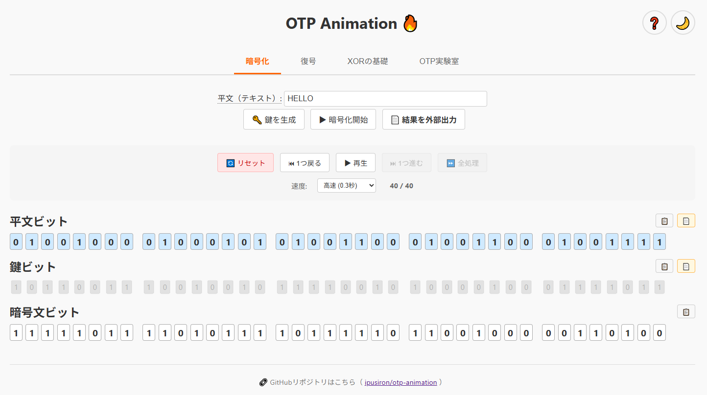

# OTP Animation - OTP（One-Time Pad）のアニメーションツール


**Day029 - 生成AIで作るセキュリティツール100**

**OTP Animation** は、古典暗号方式であるワンタイムパッド（One-Time Pad）の仕組みをアニメーションで視覚的に理解できる学習ツールです。
ビット単位のXOR処理と、鍵が「使い捨てられる」様子をアニメーションで表現しています。

---

## 🔗 デモページ

👉 [https://ipusiron.github.io/otp-animation/](https://ipusiron.github.io/otp-animation/)

---

## 📸 スクリーンショット

>
>
>*OTPの暗号化処理*

---

## 🎯 特徴

- 平文・鍵・暗号文をビット列でリアルタイムに表示
- XOR（排他的論理和）処理を1ビットずつアニメーション再現
- **使われた鍵ビットは炎のように「燃えて消える」**（視覚演出）
- プレースホルダー表示（'?'）→ 暗号ビットへの変化が明確
- 入力制限（ASCII文字のみ）＋リアルタイムバリデーション
- 視覚的に8ビットごとに区切りあり
- **ダークモード対応**（自動検出 + 手動切り替え）
- **アニメーション制御**（再生/一時停止/ステップ実行/速度調整）
- **ビット列のコピー＆ペースト機能**
- **処理結果の外部出力機能**（テキストファイル）
- **XORの基礎タブ** - XOR演算の詳細な説明と性質
- **OTP実験室タブ** - 対話的な実験による理解促進
  - 実験1: XORゲート構成シミュレーター（NOT/AND/ORからXORを構築）
  - 実験2: 鍵再利用脆弱性の実証デモ
  - 実験3: 断片解析による鍵推測デモ

---

## 🧪 使い方

### 暗号化タブ
1. **平文を入力**  
   - 例：`HELLO`（ASCII範囲のみ対応）
   - 入力に応じて自動的にビット列表示

2. **🔑 鍵を生成**  
   - 平文と同じ長さのランダムビット列を生成
   - 暗号ビット列には `?` が表示される

3. **▶ 暗号化開始**  
   - 1ビットずつXOR演算が実行され、暗号ビットが表示される
   - 同時に対応する鍵ビットが「燃えて」消費される

> ※ 鍵を生成せずに暗号化開始した場合、自動的に鍵を生成します。

### 復号タブ
- 暗号化結果を自動で反映、または手動入力
- 暗号文と鍵から元の平文を復元

### XORの基礎タブ
- XOR演算の基本概念と真理値表
- 数学的性質（交換法則、結合法則、恒等元、逆元）
- 応用分野の詳細説明

### OTP実験室タブ
- **実験1**: XORゲート構成シミュレーター
  - 入力A、Bの値を変更してリアルタイムで回路動作を確認
  - 0信号と1信号で線の色が動的に変化
  - 表のセルにホバーすると対応する回路ラベルがハイライト
- **実験2**: 鍵再利用の脆弱性実証
  - 2つの平文を同じ鍵で暗号化
  - C₁ ⊕ C₂ = P₁ ⊕ P₂ を実証
- **実験3**: 断片解析デモ
  - 平文の一部が既知の場合の鍵推測

---

## 🛠 技術スタック

- HTML / CSS / JavaScript（Vanilla）
- GitHub Pagesによる静的デモ公開
- アニメーション制御：CSS `@keyframes`, JavaScript `setTimeout`

---

## 📂 ディレクトリ構成

```
otp-animation/
├── index.html             # メインHTML
├── style.css              # スタイルシート
├── js/                    # JavaScript モジュール
│   ├── main.js            # メインエントリポイント
│   ├── encryption.js      # 暗号化タブの処理
│   ├── decryption.js      # 復号タブの処理
│   ├── xor-basics.js      # XORの基礎タブの処理
│   ├── otp-lab.js         # OTP実験室タブの処理
│   ├── bit-operations.js  # ビット演算共通処理
│   ├── clipboard.js       # クリップボード操作
│   ├── file-export.js     # ファイル出力機能
│   ├── dark-mode.js       # ダークモード切り替え
│   ├── help-modal.js      # ヘルプモーダル
│   ├── tab-manager.js     # タブ管理
│   └── utils.js           # ユーティリティー関数
└── README.md
```

---

## 🔐 ワンタイムパッドとは？

ワンタイムパッド（One-Time Pad：OTP）は、理論上もっとも安全とされる古典暗号方式です。
元来「ワンタイムパッド」は暗号のことではなく、鍵が剥ぎ取り式の用紙（パット）を意味していました（由来の詳細は後述）。

今ではワンタイムパッドといった場合は、暗号を指すことが一般的です。
どうしても分けたい場合はワンタイムパッド暗号と呼ぶのもありでしょう。

特徴は以下の通り：

- 鍵は**平文と同じ長さの完全ランダムビット列**
- 平文と鍵をXORするだけで暗号化が成立
- **一度限り**しか鍵を使用できない（再利用は禁止）
- 情報理論的に「完全秘匿性」を保証
   - 1949年にシャノンによって理論的に解読不可能であることが数学的に証明された。
   - 古典暗号の一種ですが、現代暗号の観点からも最強の安全性を保持している。
- 平文と同等以上の鍵が必要。つまり、大量の鍵が必要。
   - 鍵を配布するための精巧なプロセスが必要。
   - 多くの用途では実用的ではない。
   - コンピューターや現代暗号の登場により、ワンタイムパッドの存在意義が薄れていった。

---

### ワンタイムパッドの由来

ワンタイムパッド（One-Time Pad）の語源・由来は、物理的な紙のパッド（綴じられたメモ帳）を使った暗号システムに由来します。

用語的には"One-Time"は「一度きりの使用」「使い回し禁止」「剥ぎ取り式」、"Pad"は紙の束（メモ帳、用紙、パッド）を意味します。

鍵として使用する完全ランダムな数字列／ビット列が印刷された紙の束がパッドでした。
各ページにはランダムな鍵が記載され、暗号化・復号の際に「そのページだけを一度使ったら破棄する」というルールで用いられたのです。
ページを破り捨てることで「再利用不能（ワンタイム＝一度きり）」を実現したわけです。

この方式が軍や外交文書で使われていたため、「一度使ったら消える安全な鍵」という意味で **ワンタイムパッド** という呼称が定着しました。

---

### ワンタイムパッド vs. バーナム暗号

1917年にGilbert Vernam（ギルバート・バーナム）が米国AT&Tで働いていたときにXOR演算を用いた電信方式を提案しました。
ただし、このバーナム暗号（Vernam Cipher）は、使い捨ての鍵ではなく、繰り返しの鍵を採用していました。

その後、同時期に米陸軍のJoseph Mauborgneが「鍵が完全ランダムなら理論的に安全になる」と指摘しました。

この2人のアイディアを組み合わせることで、平文ビット列を使い捨てのランダムビット列でXOR演算する暗号が誕生します。
これこそが、現代のワンタイムパッドそのものになります。

バーナム暗号はワンタイムパッドの前身に過ぎません。
つまり、厳密には **「ワンタイムパッド≠バーナム暗号」** になります。

実際に暗号理論やセキュリティ技術文献では、ワンタイムパッドが標準的な名称になります。
しかしながら、大衆向け、あるいは教育目的の暗号本の一部では、親しみやすいバーナム暗号という呼び名を用いているケースが多々あります。
その場合は **「ワンタイムパッド＝バーナム暗号」** になります。

呼び名については、あまり神経質になる必要性はないと思います。
本質はその仕組みや性質にあります。
そのため文献を読んでいて「バーナム暗号」という呼称が登場したら、「ワンタイムパッドのことだな」と判断すればよいでしょう。

---

### 歴史的事実：ソ連のワンタイムパッド運用とその脆弱性

第二次世界大戦から冷戦期にかけて、ソ連の諜報機関であるKGB（国家保安委員会）とGRU（参謀本部情報総局）は、本国との秘密通信にワンタイムパッドを使用していました。理論上解読不可能なこの暗号は、ソ連のスパイ活動を支える重要な通信手段でした。

しかし、1941年にドイツ軍がモスクワに向けて進軍すると、戦況は一変します。ソ連政府は多くの工業施設をウラル山脈以東へ疎開させることを余儀なくされ、その中にはワンタイムパッドを製造する印刷工場も含まれていました。この混乱により、新しいパッドの製造と配布が困難になり、現場の諜報員たちはすでに使用したパッドを再利用せざるを得ない状況に陥りました。

この「鍵の再利用」という致命的なミスは、ワンタイムパッドの安全性を完全に破壊しました。アメリカの暗号解読機関は、同じ鍵で暗号化された複数のメッセージを収集・分析することで、ソ連の通信文を解読することに成功しました。この暗号解読プロジェクトは「VENONA（ベノナ）」と呼ばれ、1940年代から1980年まで極秘裏に継続されました。

VENONAプロジェクトの成果により、アメリカ国内で活動していた多数のソ連スパイが特定されました。その中には、原爆の機密情報を流出させたクラウス・フックスやローゼンバーグ夫妻など、歴史的に重要な人物も含まれていました。理論上最強の暗号であるワンタイムパッドも、運用上のミスによってその安全性が崩壊することを示す、暗号史上の重要な教訓となっています。

---

### シーザー暗号⇒シフト暗号⇒ヴィジュネル暗号⇒ワンタイムパッド

| 暗号名          | 暗号種別        | 鍵                          |
|-----------------|----------------|-----------------------------|
| シーザー暗号     | 単一換字式暗号  | シフトが3固定                |
| シフト暗号       | 単一換字式暗号  | シフトが任意（1種類）         |
| ヴィジュネル暗号 | 多表式暗号      | 鍵キーワード（シフトが数種類） |
| ワンタイムパッド | ワンタイムパッド | ランダムかつ平文長以上        |

シーザー暗号を鍵の観点で拡張することで、他の3つの暗号に変形できます。

シフト暗号は1種類のシフト、すなわち1つの置換表を用いるため、同じ平文文字は同じ暗号文文字に変換されます。

ヴィジュネル暗号は、鍵キーワードを基にして複数の置換表を用います。
そのため、同じ平文文字が別の暗号文文字に変換されます。

ヴィジュネル暗号の鍵キーワードを完全ランダムにし、鍵長を平文長以上にすれば、ワンタイムパッドそのものです。

---

### ヴィジュネル暗号⇒シーザー暗号、シフト暗号、ワンタイムパッド

逆にヴィジュネル暗号こそがベースで、他の暗号はその特殊形と捉えることもできます。

| 暗号名          | 暗号種別        | 置換表                                              |
|-----------------|----------------|----------------------------------------------------|
| シーザー暗号     | 単一換字式暗号  | 1つの置換表（固定）                                  |
| シフト暗号       | 単一換字式暗号  | 1つの置換表（アルファベットを対象にするなら実質25種類） |
| ヴィジュネル暗号 | 多表式暗号      | いくつかの置換表                                     |
| ワンタイムパッド | ワンタイムパッド | 平文長と同数の置換表                                 |

---

### 参考図書・文献（私が関与したもの）

- [『暗号技術のすべて』](https://akademeia.info/?page_id=157) P.96-107
    - バーナム暗号（＝ワンタイムパッド）の解読不可能性、バーナム暗号の死角を探る
- [『Pythonでいかにして暗号を破るか　古典暗号解読プログラムを自作する本』](https://akademeia.info/?page_id=94) P.424-429
    - Pythonでワンタイムパッドを実装
	- ツータイムパッドを避ける、ツータイムパッド暗号はヴィジュアル暗号になる
- [『暗号解読 実践ガイド』](https://akademeia.info/?page_id=39995) P.164-165、176-177
- [『シーザー暗号の解読法』](https://akademeia.info/?page_id=37037) P.92
    - ヴィジュネル暗号の「鍵キーワード長を平文長」かつ「鍵キーワードがランダム」であれば、ワンタイムパッドになる。
- [『安全な暗号をどう実装するか 暗号技術の新設計思想』](https://book.mynavi.jp/ec/products/detail/id=147364) P.10-13
    - なぜワンタイムパッドは安全なのか

---

## 🔧 技術的詳細・制限事項

詳細な技術仕様と実装の詳細については、[TECHNICAL.md](TECHNICAL.md)をご覧ください。

---

## 📄 ライセンス

MIT License - 詳細は[LICENSE](LICENSE)をご覧ください。

---

## 🛠 このツールについて

本ツールは、「生成AIで作るセキュリティツール100」プロジェクトの一環として開発されました。
このプロジェクトでは、AIの支援を活用しながら、セキュリティに関連するさまざまなツールを100日間にわたり制作・公開していく取り組みを行っています。

プロジェクトの詳細や他のツールについては、以下のページをご覧ください。

🔗 [https://akademeia.info/?page_id=42163](https://akademeia.info/?page_id=42163)