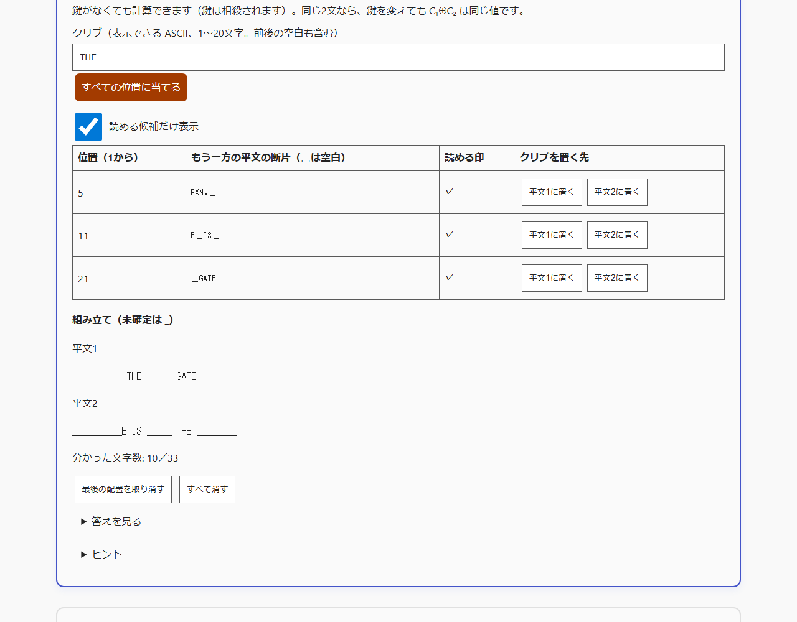
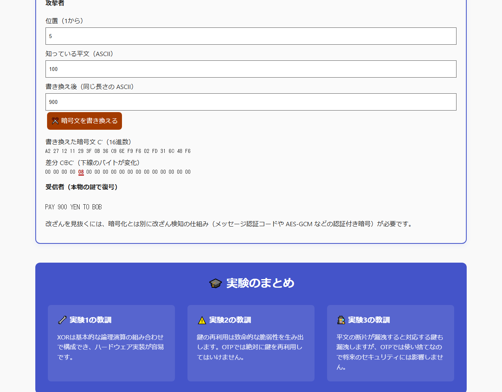

<!--
---
id: day029
slug: otp-animation

title: "OTP Animation"

subtitle_ja: "OTP（One-Time Pad）のアニメーションツール"
subtitle_en: "One-Time Pad Encryption Animation Tool"

description_ja: "ワンタイムパッド暗号の仕組みをビット単位のXOR演算アニメーションで視覚的に学習できる教育ツール。鍵の使い捨てを炎エフェクトで表現し、XORゲートシミュレーターや鍵再利用の脆弱性実証など対話的な実験機能も搭載。"
description_en: "An educational tool for visually learning One-Time Pad encryption through bit-level XOR animation. Features burn effects for key consumption, XOR gate simulator, and interactive experiments demonstrating key reuse vulnerabilities."

category_ja:
  - 古典暗号
  - 現代暗号
category_en:
  - Classical Cryptography
  - Modern Cryptography

difficulty: 2

tags:
  - OTP
  - One-Time Pad
  - XOR
  - 古典暗号
  - アニメーション
  - ビット演算

repo_url: "https://github.com/ipusiron/otp-animation"
demo_url: "https://ipusiron.github.io/otp-animation/"

hub: true
---
-->

# OTP Animation - OTP（One-Time Pad）のアニメーションツール

English: [README.en.md](README.en.md)


[](https://ipusiron.github.io/otp-animation/)

**Day029 - 生成AIで作るセキュリティツール100**

OTP Animationは、ワンタイムパッドの仕組みをビット単位のXORと「燃える鍵」で学ぶツールです。
UTF-8の日本語・絵文字も扱い、4タブと6つの実験を日英で利用できます。

## 🌐 デモページ

[ブラウザーでOTP Animationを開く](https://ipusiron.github.io/otp-animation/)

## 📸 スクリーンショット


ライト・日本語。OTP暗号の40ビット処理後。「暗」の3バイトへ段内をスクロール。1280×1200、55,572バイト。


ライト・日本語。受け取った暗号文・鍵と復号結果。ページを下へスクロール。1280×1200、54,333バイト。


ダーク・英語。HELLOとWORLDの実験2でC₁⊕C₂＝P₁⊕P₂を確認。1280×1200、53,826バイト。



ライト・日本語。実験4で「 THE 」を位置11の平文1・位置21の平文2へ配置。1280×1000、41,841バイト。



ライト・日本語。実験6の差分は5バイト目の08、受信者の結果はPAY 900 YEN TO BOB。1280×1000、60,998バイト。

## ✨ 機能

- UTF-8の平文を64バイトまで入力し、文字ごとのバイトのまとまり・16進数・ビットを表示
- crypto.getRandomValuesによる平文と同じ長さの鍵生成
- XORを1ビットずつ再生・一時停止・前進・後退し、使用済み鍵を灰色で表示
- 16進数の暗号文と鍵から復号し、不正なUTF-8を置換文字と注記で表示
- ビット列のコピー・貼り付け、結果のテキストファイル書き出し
- 状態を保持する日英切り替え、保存に対応するライト・ダーク配色
- XORの基礎と実験室（ゲート構成、鍵の再利用、既知断片からの鍵推測）
- クリブ・ドラッグで候補を探し、2つの平文を組み立てる実験4
- 同じ暗号文から別の平文に復号される鍵を導く、完全秘匿性の実験5
- 鍵を使わず暗号文のビットを反転し、金額や宛先を書き換える実験6

燃える演出は視覚表現です。使用済みの鍵を安全に消去する機能ではありません。

## 📖 使い方

### 暗号化タブ

1. 平文を入力する。例はHELLO、OTP暗号、😀。文字数とUTF-8のバイト数を確認する。
2. 「🔑 鍵を生成」で同じ長さの鍵を作る。未処理の暗号ビットは「?」になる。
3. 「▶ 暗号化開始」で再生する。再生・一時停止・1つ進む・1つ戻る・リセット・全処理を選べる。
4. 処理完了後に「結果を外部出力」で記録を保存する。

平文を変更すると鍵・進捗・暗号文が消え、再生は停止します。鍵の生成前は開始できません。
速度は0.1〜2秒の5段階です。狭い画面ではページではなくビットの段の中を横にスクロールします。

### 復号タブ

1. 「暗号化タブから受け取る」で暗号文と鍵の両方を入れる。またはそれぞれ16進数で入力する。
2. 「▶ 復号開始」または「全処理」で元のUTF-8文字列を表示する。
3. 「でたらめな鍵を試す」で同じ長さの別の鍵を生成し、正しい鍵との違いを確かめる。

入力の編集は前の結果と進捗を消します。鍵と暗号文の長さは一致が必要です。
読めないバイト列はU+FFFDと注記を表示します。別の鍵でも偶然読める文字列になる場合があります。

### XORの基礎タブ

真理値表と交換法則・結合法則・恒等元・逆元を確認できます。入力A・Bを変えると結果と説明が変わります。

### OTP実験室タブ

- 実験1：NOT・AND・ORからXORを構成。入力に応じた配線と表の値を確認
- 実験2：2つの平文を同じ鍵で暗号化。C₁⊕C₂＝P₁⊕P₂の一致を確認。長さが違えば短い方にそろえ、文字数を注記
- 実験3：既知の平文断片と1から始まる位置を入力。対応する鍵の断片だけを推測し、実際の鍵と比較
- 実験4：「🔀 新しい鍵で暗号化」→「 THE 」（前後に空白）をすべての位置に当て、候補の位置11で「平文1に置く」、位置21で「平文2に置く」を選択。取り消し・全消去・ヒント・答えの表示にも対応
- 実験5：既定のATTACK AT DAWNを「🔑 鍵を生成して暗号化」し、別の平文にRETREAT AT SIXまたは撤退せよ!!を入力。どちらも14バイトで、表示された鍵による復号結果を確認
- 実験6：既定のPAY 100 YEN TO BOBを暗号化し、位置5・100→900で「✂️ 暗号文を書き換える」を選択。位置16・BOB→EVEなら宛先を変更

実験2〜4・6の文字入力はASCIIの32〜126に限定します。実験5は暗号化・復号タブと同じUTF-8対応です。
実験4の自分の2文は各64文字まで、クリブは1〜20文字です。長さの違う2文は短い方にそろえます。
題材の両方の平文が一致すると完成を表示します。候補が読めても正解とは限らず、前後の語で確かめます。
実験5の平文は64バイトまでです。実験6の平文は64文字までで、書き換える断片の長さと位置を検査します。
平文の変更は前の暗号文・鍵・結果を消去します。実験の開閉と言語切り替えでは結果を保持します。

### 補助操作

コピーは8ビットごとの区切り付きです。貼り付けはビット列または16進数を受け取ります。
クリップボードが使えない場合は入力欄へ直接貼り付けます。読み取りは2秒で打ち切ります。
左右キーでタブを選び、?またはF1でヘルプを開きます。入力欄の?は文字として入力でき、Ctrl/Cmd+Dはブラウザーに任せます。
ヘルプ内ではTabが循環し、Escで閉じると元のボタンへ戻ります。

## 🔐 ワンタイムパッドとは

ワンタイムパッド（One-Time Pad：OTP）は、平文と鍵をXORする暗号方式です。
真にランダムで、平文と同じ長さで、一度だけ使用し、秘密に保たれる鍵という4条件がそろうと、完全秘匿性を持ちます。
大量の鍵を安全に配布・保管する必要があるため、多くの用途では現代の暗号方式が使われます。

4条件を満たすと、同じ長さのどの平文にも対応する鍵があり、暗号文だけでは元の平文を選べません（実験5）。
これは内容の秘匿であって、改ざん検知ではありません。実験6のような変更を見抜くには、メッセージ認証コードやAES-GCMなどの認証付き暗号が必要です。

### ワンタイムパッドの由来

One-Timeは一度きり、Padは綴じられた紙の束を表します。ランダムな鍵を印刷した各ページを一度使い、破棄する運用に由来します。
本ツールの燃える演出もこの使い捨てを表しています。

### ワンタイムパッドとバーナム暗号

1917年、Gilbert Vernamは電信のデータと鍵を組み合わせる方式を考案しました。
繰り返す鍵を使うバーナム方式と、真にランダムな鍵を一度だけ使うOTPは区別が必要です。
Joseph Mauborgneによるランダムな鍵の考え方もOTPの歴史に関わります。
文献で「バーナム暗号」がOTPを指す場合もあるため、名称だけでなく鍵の条件を確認します。

### ソ連の運用とVENONA

1942年初め、ソ連の暗号担当部門はドイツ軍の侵攻による混乱のなかで約35,000ページ分の鍵を重複して印刷し、重複分を離れた利用者へ配りました。
NKVD・NKGB（のちのKGB）とGRUなどの通信に生じた鍵の重複が、VENONAでの解読の糸口になりました。
解読できたのは全体のごく一部であり、正しく使うOTPの完全秘匿性が破られたわけではありません。
実験4では、この鍵の再利用から語を推測して平文を組み立てる考え方を体験できます。
出典は[NSAのCryptologic Almanac「VENONA: An Overview」](https://www.nsa.gov/Portals/70/documents/news-features/declassified-documents/crypto-almanac-50th/VENONA_An_Overview.pdf)です。

### シーザー暗号からワンタイムパッドへ

| 暗号名 | 暗号種別 | 鍵 |
|---|---|---|
| シーザー暗号 | 単一換字式暗号 | シフトが3固定 |
| シフト暗号 | 単一換字式暗号 | 1種類の任意のシフト |
| ヴィジュネル暗号 | 多表式暗号 | 繰り返す鍵キーワード |
| ワンタイムパッド | ワンタイムパッド | 真にランダム・平文と同じ長さ・一度きり・秘密 |

シフト暗号では1つの置換表を使い、ヴィジュネル暗号では鍵に応じて複数の置換表を使います。
アルファベット上の加算でも、鍵を独立一様に選び、平文と同じ長さで秘密に一度だけ使えばOTPになります。
本ツールは文字の置換ではなくUTF-8の各バイトをXORします。

### ヴィジュネル暗号を基点にした比較

| 暗号名 | 暗号種別 | 置換表 |
|---|---|---|
| シーザー暗号 | 単一換字式暗号 | 固定の1表 |
| シフト暗号 | 単一換字式暗号 | 1表。英字の恒等変換を除けば25候補 |
| ヴィジュネル暗号 | 多表式暗号 | 鍵に応じた複数の表 |
| ワンタイムパッド | ワンタイムパッド | 各位置に独立したランダムな置換 |

## 🔬 仕様と既知解答

平文はTextEncoderのUTF-8、上限は64バイトです。空、制御文字U+0000〜U+001F・U+007F、孤立サロゲートは拒否します。
「あ」は3バイト、😀は4バイトです。表示は上位ビットから8ビット単位で、文字ごとのまとまりを保ちます。

16進数は大文字2桁を半角空白で区切って表示します。入力では大文字・小文字、0x、空白・コロン・ハイフン・アンダースコアを扱います。
ビット列の区切りには空白・アンダースコア・カンマ・縦棒・ハイフンを使えます。8の倍数でない列は拒否します。
実際の鍵はcrypto.getRandomValuesで生成します。

次の表は決定的なテスト鍵（バイト位置iに対して(i×73+41)&255）による既知解答です。
**テスト用の鍵は実際の暗号化に使ってはいけません。**

| 平文 | UTF-8の16進数 | バイト数 | 鍵（テスト用） | 暗号文 |
|---|---|---|---|---|
| HELLO | 48 45 4C 4C 4F | 5 | 29 72 BB 04 4D | 61 37 F7 48 02 |
| A | 41 | 1 | 29 | 68 |
| あ | E3 81 82 | 3 | 29 72 BB | CA F3 39 |
| OTP暗号 | 4F 54 50 E6 9A 97 E5 8F B7 | 9 | 29 72 BB 04 4D 96 DF 28 71 | 66 26 EB E2 D7 01 3A A7 C6 |
| Hi!? | 48 69 21 3F | 4 | 29 72 BB 04 | 61 1B 9A 3B |
| 😀 | F0 9F 98 80 | 4 | 29 72 BB 04 | D9 ED 23 84 |

表の全セルはOtpCoreで再計算するテストで検証しています。技術的な詳細は[TECHNICAL.md](TECHNICAL.md)にあります。

### 実験4〜6の既知解答

以下も同じ決定的なテスト鍵を使った参照値です。テスト用の鍵は実際の暗号化に使ってはいけません。
画面は毎回新しい乱数鍵を生成するため暗号文は変わりますが、候補・復号結果・改ざんの差分は同じです。

<!-- lab-sample -->
| 平文 | 題材の文 | バイト数 |
|---|---|---|
| 1 | `MEET ME AT THE NORTH GATE AT NOON` | 33 |
| 2 | `THE PACKAGE IS UNDER THE OLD OAK.` | 33 |

C₁⊕C₂は鍵によらず`19 0D 00 74 70 0C 06 6B 00 13 65 74 01 16 00 1B 01 16 11 1A 00 13 09 11 65 6F 0D 10 00 01 0E 04 60`です。
「 THE 」の全29位置のうち、読める候補は次の3つです。引用符の内側の空白も文字に含みます。
位置は1から数え、位置5は偶然の外れです。位置11は平文1、位置21は平文2にクリブを置くと題材と一致します。

<!-- lab-crib -->
| 位置 | クリブ | もう一方の平文の断片 |
|---|---|---|
| 5 | `" THE "` | `"PXN. "` |
| 11 | `" THE "` | `"E IS "` |
| 21 | `" THE "` | `" GATE"` |

実験5では、ATTACK AT DAWNの暗号文を固定したまま、各平文に復号される鍵を導きます。

<!-- lab-secrecy -->
| 復号される平文 | 鍵 | 共通の暗号文 |
|---|---|---|
| `ATTACK AT DAWN` | 29 72 BB 04 4D 96 DF 28 71 BA 03 4C 95 DE | 68 26 EF 45 0E DD FF 69 25 9A 47 0D C2 90 |
| `RETREAT AT SIX` | 3A 63 BB 17 4B 9C AB 49 64 CE 67 5E 8B C8 | 68 26 EF 45 0E DD FF 69 25 9A 47 0D C2 90 |
| `撤退せよ!!` | 8E B4 4B AC 8E 5D 1C E8 BE 79 C5 85 E3 B1 | 68 26 EF 45 0E DD FF 69 25 9A 47 0D C2 90 |

実験6の元の平文はPAY 100 YEN TO BOBです。受信者は同じ本物の鍵で復号します。

<!-- lab-tamper -->
| 位置（1から） | 既知の断片 | 書き換え後 | 暗号文 | 受信者の復号結果 |
|---|---|---|---|---|
| - | - | - | 79 33 E2 24 7C A6 EF 08 28 FF 4D 6C C1 91 07 32 F6 40 | `PAY 100 YEN TO BOB` |
| 5 | 100 | 900 | 79 33 E2 24 74 A6 EF 08 28 FF 4D 6C C1 91 07 32 F6 40 | `PAY 900 YEN TO BOB` |
| 16 | BOB | EVE | 79 33 E2 24 7C A6 EF 08 28 FF 4D 6C C1 91 07 35 EF 47 | `PAY 100 YEN TO EVE` |

100→900の差分は`00 00 00 00 08 00 00 00 00 00 00 00 00 00 00 00 00 00`で、5バイト目だけが変わります。

## 🔒 セキュリティ

このツールは教育用のデモです。実データの秘匿や安全な鍵配送・消去には使わないでください。
書き出すファイルには平文・鍵・暗号文が含まれます。

- meta CSPでスクリプト・スタイルを同一オリジンに限定。インラインハンドラーとインラインスタイルを不使用
- referrerをno-referrerに設定
- アプリからの外部通信なし。平文・鍵・暗号文をconsoleへ出力しない
- localStorageに保存するのはテーマと言語のみ。同じブラウザー内だけで保持し、保存を遮断しても利用可能
- 暗号状態はバイト列と済んだビット数だけで管理。入力変更時は古い結果を無効化

## 📚 参考

- [『暗号技術のすべて』](https://akademeia.info/?page_id=157)P.96-107
    - バーナム暗号（＝ワンタイムパッド）の解読不可能性、バーナム暗号の死角を探る
- [『Pythonでいかにして暗号を破るか　古典暗号解読プログラムを自作する本』](https://akademeia.info/?page_id=94) P.424-429
    - Pythonでワンタイムパッドを実装
    - ツータイムパッドを避ける、ツータイムパッド暗号はヴィジュネル暗号になる
- [『暗号解読 実践ガイド』](https://akademeia.info/?page_id=39995) P.164-165、176-177
- [『シーザー暗号の解読法』](https://akademeia.info/?page_id=37037) P.92
    - 真にランダム・平文と同じ長さ・一度きり・秘密の鍵が必要。
- [『安全な暗号をどう実装するか 暗号技術の新設計思想』](https://book.mynavi.jp/ec/products/detail/id=147364) P.10-13
    - なぜワンタイムパッドは安全なのか


- [NSA Cryptologic Almanac: VENONA: An Overview](https://www.nsa.gov/Portals/70/documents/news-features/declassified-documents/crypto-almanac-50th/VENONA_An_Overview.pdf)（一次資料）
- [Wikipedia: Venona project](https://en.wikipedia.org/wiki/Venona_project)（補助資料）

## 🧪 テスト

Node.js 22で、依存を追加せずに実行できます。

```sh
npm test
```

- core.test.js：既知解答6件、入力検査、200本のUTF-8往復、16進数・ビットの往復、弱い乱数APIの禁止
- core.test.jsの追加検査：5種のクリブの候補、組み立て・食い違い、完全秘匿性と改ざんの既知解答、鍵導出と改ざん各100組の性質
- i18n.test.js：日英キー一致、空値、使用キー、補間値、日本語の直書き
- html.test.js：CSP・ARIA・インライン処理の禁止・初回テーマ・トーストの非操作性
- contrast.test.js：ライト・ダークの文字色と背景色が4.5:1以上
- format.test.js：最長行と行数の下限
- readme.test.js：既知解答の表、YAML、見出し、実ファイルとツリー、画像、史実の再発防止語

GitHub Actionsはpushとpull_requestでnpm testを実行します。

## 📁 ディレクトリー構造

```
otp-animation/                   # プロジェクトのルート
├── .github/                     # GitHubの設定
│   └── workflows/               # GitHub Actionsのワークフロー
│       └── test.yml             # pushとpull_requestでNode 22のテストを実行
├── .gitignore                   # Git管理の除外設定
├── .nojekyll                    # Jekyll処理を無効化
├── CLAUDE.md                    # 開発ガイド
├── LICENSE                      # MITライセンス
├── README.md                    # 日本語の使い方・仕様
├── README.en.md                 # 英語版README
├── TECHNICAL.md                 # UTF-8・状態・CSP・クリップボードの仕様
├── package.json                 # 依存なしのnode --test定義
├── index.html                   # 4タブ・ヘルプ・CSP
├── style.css                    # 配色・狭幅表示・燃える演出
├── assets/                      # README用の画像
│   ├── screenshot.png           # 暗号化途中のOTP暗号・40ビット済み
│   ├── screenshot2.png          # 受け取った暗号文と鍵による復号完了
│   ├── screenshot3.png          # ダーク・英語の実験2の結果
│   ├── screenshot4.png          # 実験4の候補と平文の組み立て
│   └── screenshot5.png          # 実験6の改ざん差分と受信者の復号結果
├── js/                          # file://対応のclassic script
│   ├── otp-core.js              # UTF-8・16進数・ビット・XOR・鍵生成の中核
│   ├── bit-operations.js        # 文字とバイトの描画
│   ├── tab-manager.js           # ARIA・左右キー対応タブ
│   ├── encryption.js            # 暗号化の状態と再生
│   ├── decryption.js            # 16進数入力・復号の状態と再生
│   ├── clipboard.js             # コピー・貼り付け・トースト
│   ├── file-export.js           # テキストファイル書き出し
│   ├── dark-mode.js             # テーマ切り替え
│   ├── theme-init.js            # 初回描画前のテーマ適用
│   ├── help-modal.js            # ヘルプのダイアログ
│   ├── i18n.js                  # 日英辞書と言語切り替え
│   ├── xor-basics.js            # XORの基礎
│   ├── otp-lab.js               # 実験1〜6と各実験の状態
│   └── main.js                  # 起動処理
└── test/                        # 依存なしの自動テスト
    ├── core.test.js             # 既知解答・入力検査・往復・弱い乱数APIの禁止
    ├── i18n.test.js             # 辞書・使用キー・日本語直書きの検査
    ├── html.test.js             # CSP・ARIA・禁止API・初回配色
    ├── contrast.test.js         # ライト・ダークのコントラスト
    ├── format.test.js           # 最長行・行数の下限
    └── readme.test.js           # 既知解答の表・YAML・構造・画像
```

## 💻 動作環境

TextEncoder・TextDecoder・crypto.getRandomValuesに対応するブラウザーが必要です。
index.htmlを直接開くfile://とローカルHTTPの両方で動きます。依存ライブラリー・ビルド処理・外部CDNはありません。

```sh
python -m http.server 8000
```

HTTPの場合はhttp://localhost:8000/を開きます。クリップボードAPIの利用可否はブラウザーの権限に従います。

## 📄 ライセンス

MIT License。詳細は[LICENSE](LICENSE)をご覧ください。

## 🛠️ このツールについて

本ツールは、「生成AIで作るセキュリティツール100」プロジェクトの一環として開発されました。
このプロジェクトでは、AIの支援を活用しながら、セキュリティに関連するさまざまなツールを100日間にわたり制作・公開していく取り組みを行っています。

プロジェクトの詳細や他のツールについては、[プロジェクトページ](https://akademeia.info/?page_id=42163)をご覧ください。
